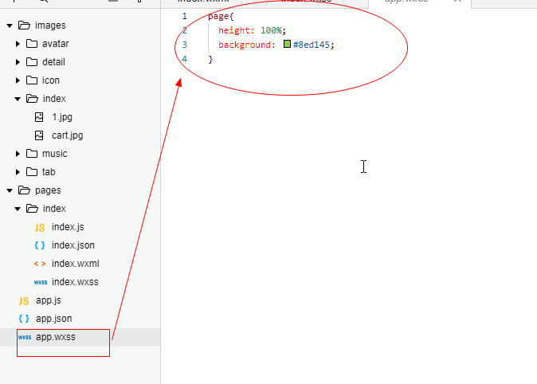

## 小程序

# 第1章 什么是小程序？

1. 2017年度百度百科十大热词之一
2. [微信](https://baike.baidu.com/item/%E5%BE%AE%E4%BF%A1/3905974)小程序（wei xin xiaocheng xu），简称[小程序](https://baike.baidu.com/item/%E5%B0%8F%E7%A8%8B%E5%BA%8F)，英文名Mini Program，是一种不需要下载安装即可使用的[应用](https://baike.baidu.com/item/%E5%BA%94%E7%94%A8) ( 张小龙对其的定义是无需安装，用完即走，实际上是需要安装的，只不过小程序的体积特别小， 下载速度很快，用户感觉不到下载的过程 )
3. 小程序刚发布的时候要求压缩包的体积不能大于1M,，否则无法通过，在2017年4月做了改进，由原来的1M提升到2M；
4. 2017年1月9日0点，万众瞩目的微信第一批小程序正式低调上线。

# 第2章 小程序可以干什么？

1. 同App进行互补，提供同app类似的功能，比app操作更加简洁的轻应用

2. 通过扫一扫或者在微信搜索即可下载

3. 用户使用频率不高，但又不得不用的功能软件，目前看来小程序是首选

4. 连接线上线下

5. 开发门槛低， 成本低

   

# 第3章 小程序开发资料

注册小程序

1) 官网：[https://mp.weixin.qq.com/](https://mp.weixin.qq.com/)

wechat_devtools_1.02.1907160_x64.exe 安装包 

下载地址:[https://mp.weixin.qq.com/debug/wxadoc/dev/devtools/download.html?t=2018315](https://mp.weixin.qq.com/debug/wxadoc/dev/devtools/download.html?t=2018315)

2) 注册小程序账号




# 第4章 开发小程序项目

### 1.小程序没有DOM对象,一切基于组件化

### 2.小程序的四个重要文件

	1. *.js------功能文件
	2. *.wxml---->view结构---->html文件
	3. *.wxss---->view样式---->css文件
	4. *.json---->view数据----->json文件

### 3.需要用到的知识

​	1.事件机制(事件的绑定,分发...)

​	2.组件化(组件:具有特定功能效果的集合,功能带有交互性,必然有js)

​	3.数据绑定

​	4.flex布局

​	5.移动端适配方案

### 4.Flex布局简介

1) Flex是Flexible Box的缩写，意为”弹性布局”，用来为盒状模型提供最大的灵活性。

2) 任何一个容器都可以指定为Flex布局。

3) display: ‘flex’


4)flex属性

flex-direction:

row（默认值）：主轴为水平方向，起点在左端。

row-reverse：主轴为水平方向，起点在右端。

column：主轴为垂直方向，起点在上沿。

column-reverse：主轴为垂直方向，起点在下沿。

flex学习地址:

[http://www.runoob.com/w3cnote/flex-grammar.html](http://www.runoob.com/w3cnote/flex-grammar.html)

### 5.移动端适配

​	1.物理像素:

​		1) 屏幕的分辨率

​		2) 设备能控制显示的最小单元，可以把物理像素看成是对应的像素点

​	2.设备独立像素 & css像素

​		1)设备独立像素(也叫密度无关像素)，可以认为是计算机坐标系统中的一个点，这个点代表一个可以由程序使用并控制的虚拟像素(比如：CSS 像素,只是在android机中CSS 像素就不叫”CSS 像素”了而是叫”设备独立像素”)，然后由相关系统转换为物理像素。

​	3.dpr比 & DPI & PPI

1) dpr: 设备像素比，物理像素/设备独立像素 = dpr，一般以Iphon6的dpr为准 dpr = 2

2) PPI: 一英寸显示屏上的像素点个数

3) DPI：最早指的是打印机在单位面积上打印的墨点数，墨点越多越清晰


### 6.小程序适配方案***

Iphon6： 1rpx = 1物理像素 =0.5px

微信官方提供的换算方式：

1. 以iPhone6的物理像素个数为标准: 750;
2. 1rpx = 目标设备宽度 / 750 * px; 
3. 注意此时底层已经做了viewport适配的处理，即实现了理想视

### 7.扩展内容

视网膜屏幕是分辨率超过人眼识别极限的高分辨率屏幕，由[苹果公司](https://baike.baidu.com/item/%E8%8B%B9%E6%9E%9C%E5%85%AC%E5%8F%B8)在2010年在[iPhone 4](https://baike.baidu.com/item/iPhone%204)发布会上首次推出营销术语。

Iphone的dpr = 2;人类肉眼分辨的极限

问题：Iphone6的dpr为多少？Iphone6Plus比Iphone显示图像清晰吗？


# 第5章 程序介绍


# 第6章 开发小程开始

```javascript
<view class="indexContainer">
  <image class="indexImage" src="/images/index/1.jpg"></image>
  <text class="indexUser">Hello {{msg}}</text>
  <view class="goStudy" catchtap="handleParent">
    <input value="{{msg}}"></input>
    <text catchtap="handleChild">开启小程序之旅</text>
  </view>
</view>

    
.indexContainer{
  display: flex;
  flex-direction: column;
  align-items: center;
}
.indexImage{
  width: 200rpx;
  height: 200rpx;
  border-radius: 100rpx;
  margin: 160rpx;
}
.indexUser{
  font-size: 32rpx;
  font-weight: 700;
  margin: 100rpx;
}
.goStudy{
  width: 200rpx;
  height: 80rpx;
  border:1px solid #ccc;
  font-size: 24rpx;
  text-align: center;
  line-height: 80rpx;
  border-radius: 50rpx;
}

onLoad: function (options) {
    // console.log('onLoad')
    // // 抱歉,没有数据代理
    // console.log(this)
    // // 可以
    // console.log(this.data.msg)
    // // 也可以
    // console.log(this.__data__.msg)
    // //console.log(this.__data.msg)
    // // 修改数据
    // this.setData({
    //   msg:'已经修改了'
    // })
    // // 必须用箭头函数,否则this指向改变
    // setTimeout(()=>{
    //   this.setData({
    //     msg:'能改变吗'
    //   })
    // },1000)
   
  },
  // 父级元素的点击事件
  // handleParent(){
  //   console.log('父级元素被点了')
  // },
  // // 子级元素的点击事件
  // handleChild(){
  //   console.log('子级元素被点了')
  // },
```





#### 1.小程序中没有数据代理

​	

#### 2.在onload中修改数据

```javascript
/**
   * 生命周期函数--监听页面加载
   */
  onLoad: function (options) {
    console.log('onLoad')
    // 抱歉,没有数据代理
    console.log(this)
    // 可以
    console.log(this.data.msg)
    // 也可以
    console.log(this.__data__.msg)
    //console.log(this.__data.msg)
    // 修改数据
    this.setData({
      msg:'已经修改了'
    })
    // 必须用箭头函数,否则this指向改变
    setTimeout(()=>{
      this.setData({
        msg:'能改变吗'
      })
    },1000)
   
  },
```

#### 3.小程序特点

​	1)没有DOM

​	2)没有数据代理

​	3)没有双向绑定

#### 4.自定义事件

) 冒泡事件

a) 定义：冒泡事件：当一个组件上的事件被触发后，该事件会向父节点传递。

b) 冒泡事件列表：

[https://mp.weixin.qq.com/debug/wxadoc/dev/framework/view/wxml/event.html](https://mp.weixin.qq.com/debug/wxadoc/dev/framework/view/wxml/event.html)

2) 非冒泡事件

a) 定义：当一个组件上的事件被触发后，该事件不会向父节点传递。

b) 非冒泡事件：表单事件和自定义事件通常是非冒泡事件

[https://mp.weixin.qq.com/debug/wxadoc/dev/framework/view/wxml/event.html](https://mp.weixin.qq.com/debug/wxadoc/dev/framework/view/wxml/event.html)


### 事件绑定和冒泡

事件绑定的写法同组件的属性，以 key、value 的形式。

- key 以`bind`或`catch`开头，然后跟上事件的类型，如`bindtap`、`catchtouchstart`。自基础库版本 [1.5.0](https://developers.weixin.qq.com/miniprogram/dev/framework/compatibility.html) 起，在非[原生组件](https://developers.weixin.qq.com/miniprogram/dev/component/native-component.html)中，`bind`和`catch`后可以紧跟一个冒号，其含义不变，如`bind:tap`、`catch:touchstart`。
- value 是一个字符串，需要在对应的 Page 中定义同名的函数。不然当触发事件的时候会报错。

`bind`事件绑定不会阻止冒泡事件向上冒泡，`catch`事件绑定可以阻止冒泡事件向上冒泡。

如在下边这个例子中，点击 inner view 会先后调用`handleTap3`和`handleTap2`(因为tap事件会冒泡到 middle view，而 middle view 阻止了 tap 事件冒泡，不再向父节点传递)，点击 middle view 会触发`handleTap2`，点击 outer view 会触发`handleTap1`。

```javascript
事件冒泡:
<view class="goStudy" bindtap="handleParent">
    <!-- <input value="{{msg}}"></input> -->
    <text bindtap="handleChild">开启小程序之旅</text>
  </view>
    
// 父级元素的点击事件
  handleParent(){
    console.log('父级元素被点了')
  },
  // 子级元素的点击事件
  handleChild(){
    console.log('子级元素被点了')
  },
```


```javascript
非事件冒泡: 把上面的bindtap换成catchtap 
<view class="goStudy" catchtap="handleParent">
    <!-- <input value="{{msg}}"></input> -->
    <text catchtap="handleChild">开启小程序之旅</text>
  </view>
    
<view class="goStudy" catchtap="toList">
<text>开启小程序之旅</text>
</view>
在index.js文件中
 toList(){
  wx.redirectTo({
    url: "/pages/list/list",
    success: () => {
      console.log('成功了')
    }
  })
  // wx.navigateTo({
  //   url: "/pages/list/list",
  //   success:()=>{
  //     console.log('成功了')
  //   }
  // })
},
```

# 第7章 继续开发List

```javascript
app.json中
 "navigationBarBackgroundColor": "#489B81", //全局的顶部颜色
index.json中
 "navigationBarBackgroundColor": "#8ed145" //当前页面的顶部的颜色
list.json中
  "navigationBarTitleText": "硅谷周刊"   //顶部文字
把app.json中的pages里面内容交换一下
  "pages": [
    "pages/list/list", //不必每次都看到首页
    "pages/index/index"
  ],

```

#### 1.轮播图


```javascript
list.wxml中
自动轮播,是否有小圆点,圆点的颜色,默认圆点的颜色
<view class="listContainer" >
  <swiper autoplay="true" indicator-dots="true" indicator-color="green" indicator-active-color="#fff" circular="true">
    <swiper-item>
      <image src="/images/detail/carousel/01.jpg"></image>
    </swiper-item>
    <swiper-item>
      <image src="/images/detail/carousel/02.jpg"></image>
    </swiper-item>
    <swiper-item>
      <image src="/images/detail/carousel/03.jpg"></image>
    </swiper-item>
    <swiper-item>
      <image src="/images/detail/carousel/04.jpg"></image>
    </swiper-item>
  </swiper>
</view>
```

#### 2.模版


```javascript
创建一个listTmp目录,里面干掉js和json（直接报错）
错误:解决: 直接把app.json中 的下面那行代码干掉
VM3443:1 未找到 app.json 中的定义的 pages "pages/listTmp/listTmp" 对应的 JS 文件
如:下图

```


```javascript
//listTmp.wxml中
<template name="listTmp">
  <view class="tmpContainer">
    测试。。。
  </view>
</template>
//list.wxml中
下面的代码放在最上面
<import src="/pages/listTmp/listTmp.wxml"/>
  在使用的位置
<template is="listTmp" />
 在list.wxss中引入listTmp样式   
@import '/pages/listTmp/listTmp.wxss';
```

```css
/* pages/listTmp/listTmp.wxss */
.tmpContainer{
  display: flex; /*伸缩布局*/
  flex-direction: column  /*改变主轴*/
}
.avator_data{
  padding: 10rpx;
}
.avator_data image{
  width: 60rpx;  /*宽和高*/
  height: 60rpx;
  vertical-align: middle; /*垂直对齐显示*/
  margin-right: 10rpx;
}
.avator_data text{
  font-size: 32rpx;
  vertical-align: middle;
}
.company{
  padding: 10rpx;
  font-size: 40rpx;
  font-weight: 700;
}
.tmpImg{
  width: 100%;
  height: 340rpx;
}
.txt{
  font-size: 32rpx;
  margin-left: 10rpx;
  line-height: 50rpx;
  text-indent: 32rpx;
  /* word-spacing: 20rpx; 英文 */
  /* letter-spacing: 50rpx; 中文 */
}
.star_view_container image{
  width: 32rpx;
  height: 32rpx;
  vertical-align: middle;
}
.star_view_container text{
  font-size: 24rpx;
  color: #666;
  vertical-align: middle;
  margin: 0 16rpx;
}
```

```javascript
//list.js中 
let listDatas=require('../../datas/list-data.js')
data{
  listArr:[]
}
onload:function(){
  this.setData({
    listArr:listDatas.list_data
  })
}
//list.wxml中---------官方文档中---->直接使用index--索引,item---每个选项(元素)
<block wx:for="{{listArr}}" wx:key="{{index}}">
    <view>
      <template is="listTmp" />
    </view>
</block>
```


#### 3.list界面及模版使用

```html
list.wxml文件中
<block wx:for="{{listData}}" wx:key="{{index}}" >
    <view catchtap="toDetail" data-index="{{index}}">
      <template is="detailTemplate" data="{{...item}}" />
    </view>
  </block>
list.js文件中
let listData = require('../../datas/list-data.js')
  data: {
    listData: [] // 用来存储数组
  },
  onLoad: function(options) {
    // 更新listData数据
    this.setData({
      listData: listData.list_data
    })
    // console.log(this.data.listData)
  },
  toDetail(event) {
    // 获取传入进来的索引
    const index = event.currentTarget.dataset.index
    
    wx.navigateTo({
      // 通过路由进行传参
      url: '/pages/detail/detail?index='+index,
    })
  },

listTmp.wxml文件中
<template name="detailTemplate">
  <view class="tmpContainer">
    <view class="avatarData">
      <image src="{{avatar}}"></image>
      <text>{{date}}</text>
    </view>
    <text class="company">{{title}}</text>
    <image class="contentImage" src="{{detail_img}}"></image>
    <text class="text">{{detail_content}}</text>
    <view class="imageAndText">
      <image src="{{detail_love_image1}}"></image>
      <text>{{love_count}}</text>
      <image src="{{detail_love_image2}}"></image>
      <text>{{attention_count}}</text>
    </view>
  </view>
</template>
```


#### 4.detail界面


```html

<!--pages/detail/detail.wxml-->
<view class="detailContainer">
  <image class="detail_header" src="/images/index/cart.jpg"></image>
  <view class="detail_author_date">
    <image src="/images/avatar/0.png"></image>
    <text>钢铁侠</text>
    <text>发布于</text>
    <text>2019</text>
  </view>
  <text class="detail_company">尚硅谷</text>
  <view class="detail_collection_share">
    <view class="col_share_img">
      <image src="/images/icon/collection-anti.png" catchtap="handleCollection"></image>
      <image src="/images/icon/share.png" catchtap="handleShare"></image>
    </view>
<view class="line"></view>
  </view>
  <button open-type="share">转发此文章</button>
  <text class="detail_content">让每个人都爱学习</text>
</view>
```

```css
/* pages/detail/detail.wxss */
.detailContainer {
  display: flex;
  flex-direction: column;
}

.detail_header{
  width:100%;
  height:460rpx;
}

.musicImg {
  width:60rpx;
  height:60rpx;
  position: absolute;
  left:50%;
  top:200rpx;
  margin-left: -30rpx;
}

.detail_author_date {
  padding:10rpx;
}

.detail_author_date image{
  width:64rpx;
  height:64rpx;
  border-radius: 32rpx;
  vertical-align: middle;
}

.detail_author_date text {
  font-size: 14px;
  vertical-align: middle;
  margin-left: 6px;
}

.detail_company {
  font-size: 32rpx;
  font-weight: bold;
  margin:10rpx 0 10rpx 30rpx;
}

.detail_collection_share{
  position: relative;
}


.col_share_img {
  float: right;
  margin-right: 60rpx;
}

.col_share_img image {
  width:90rpx;
  height:90rpx;
  margin-right:10rpx;
}


.line {
  position: absolute;
  top:45rpx;
  left: 5%;
  width:90%;
  height:1px;
  background: #eee;
  z-index:-1;
}

.detail_content {
  font-size: 14px;
  line-height: 28px;
  text-indent: 14px;
}

button{
  width:260rpx;
  height:80rpx;
}
```

```html
  onLoad: function (options) {
    console.log(options)
    this.setData({
      detailObj: listData.list_data[options.index]
    })
    console.log(this.data.detailObj)
  },

```


#### 4.事件委托

​	1)什么是事件委托:把子元素的事件委托给父级元素上

​	2)事件委托的优点:只需要绑定一次,减少绑定次数,新增添的子元素同样可以使用之前的绑定事件

​	3)事件委托的原理:通过事件冒泡,真正触发该事件的对象是子元素

​	4)触发该事件的事件源:target

#### 5.收藏功能

```javascript
// pages/detail/detail.js
let listData =require('../../datas/list-data.js')
Page({

  /**
   * 页面的初始数据
   */
  data: {
    detailObj:{}, //存储当前传入过来的detailObj对象
    isCollectioned:false  //默认没有选中,也没有收藏
  },

  /**
   * 生命周期函数--监听页面加载
   */
  onLoad: function (options) {
   // console.log(options)
   let index=options.index
    this.setData({
      detailObj: listData.list_data[index],
      index: index
    })
    // 立刻读缓存
    let storage = wx.getStorageSync('isCollectioned')
    // 判断键对应的值
    if(storage[index]){
      this.setData({
        isCollectioned:true
      })
    }
  },
   // 点击收藏和取消收藏
  handleCollection(){
    //设置收藏的值
    let isCollectioned = !this.data.isCollectioned
    this.setData({
      isCollectioned
    })
    // 显示收藏和没有收藏的提示消息
    let title = isCollectioned?'收藏成功':'收藏失败'
    wx.showToast({
      title
    })

    // 缓存数据--是否收藏级对应的index值
    let index = this.data.index
    // 读取缓存中的数据
    let obj = wx.getStorageSync('isCollectioned')
    obj=obj?obj:{} // 预处理,空字符串问题
    // 通过对象的方式存储数据
    obj[index] = isCollectioned
    // 设置缓存
    wx.setStorage({
      key:'isCollectioned',
      data:obj
    })
  },
```


#### 6.播放功能

```javascript
// pages/detail/detail.js
let listData = require('../../datas/list-data.js')
Page({

  /**
   * 页面的初始数据
   */
  data: {
    detailObj: {}, //存储当前传入过来的detailObj对象
    isCollectioned: false, //默认没有选中,也没有收藏
    isPlay: false //播放器的状态
  },

  /**
   * 生命周期函数--监听页面加载
   */
  onLoad: function(options) {
    // console.log(options)
    let index = options.index
    this.setData({
      detailObj: listData.list_data[index],
      index: index
    })
    // 立刻读缓存
    let storage = wx.getStorageSync('isCollectioned')
    // 判断键对应的值
    if (storage[index]) {
      this.setData({
        isCollectioned: true
      })
    }

    // 监听音乐播放和暂停
    let appData = getApp() //----------------------在App.js中存储了数据
    // 判断这个状态
    if (appData.data.isMusicPlay && appData.data.pageIndex === index) {
      // 我缓存的是播放,那么你再次进来之后就要继续的播放
      this.setData({
        isPlay: true
      })
    }
    wx.onBackgroundAudioPlay(() => {
      //播放
      this.setData({
        isPlay: true
      })
      // 播放的时候把状态保存到全局的App的data中进行缓存
      appData.data.isMusicPlay = true
      appData.data.pageIndex = index
    })
    wx.onBackgroundAudioPause(() => {
      //暂停
      this.setData({
        isPlay: false
      })
      // 播放的时候把状态保存到全局的App的data中进行缓存
      appData.data.isMusicPlay = false
      //appData.data.pageIndex = index
    })
  },
  // 点击收藏和取消收藏
  handleCollection() {
    //设置收藏的值
    let isCollectioned = !this.data.isCollectioned
    this.setData({
      isCollectioned
    })
    // 显示收藏和没有收藏的提示消息
    let title = isCollectioned ? '收藏成功' : '收藏失败'
    wx.showToast({
      title
    })

    // 缓存数据--是否收藏级对应的index值
    let index = this.data.index
    // 读取缓存中的数据
    let obj = wx.getStorageSync('isCollectioned')
    obj = obj ? obj : {} // 预处理,空字符串问题
    // 通过对象的方式存储数据
    obj[index] = isCollectioned
    // 设置缓存
    wx.setStorage({
      key: 'isCollectioned',
      data: obj
    })
  },
  // 分享
  handleShare() {
    wx.showActionSheet({
      itemList: ["分享朋友圈", "分享到收藏", "分享给好友"]
    })
  },
  // 播放音乐
  handleMusicPlay() {
    let isPlay = !this.data.isPlay
    this.setData({
      isPlay
    })
    // 播放音乐
    let {
      dataUrl,
      title,
      coverImgUrl
    } = this.data.detailObj.music
    if (isPlay) {
      wx.playBackgroundAudio({
        dataUrl: dataUrl,
        title: title,
        coverImgUrl: coverImgUrl
      })
    } else {
      wx.pauseBackgroundAudio()
    }
  },
})

App({

  data:{
    isMusicPlay:false, // 默认是不播放状态
    pageIndex:null // 默认不知道是哪个页面
  },
```


#### 7.tab切换

```javascript
app.json中
"tabBar":{
    "list":[
      {
        "pagePath": "pages/list/list",
        "text": "文与字",
        "iconPath": "/images/tab/yuedu.png",
        "selectedIconPath": "/images/tab/yuedu_hl.png"
      },
      {
        "pagePath": "pages/movies/movies",
        "text": "电影频道",
        "iconPath": "/images/tab/dianying.png",
        "selectedIconPath": "/images/tab/dianying_hl.png"
      }
    ]
  }
index.js文件中,必然要改动
    wx.switchTab({
      // 根路径中查找
      url: '/pages/list/list'
    })
```


#### 8.获取登录信息

```html
<view class="indexContainer">
  <image wx:if="{{userInfo.avatarUrl}}" class="indexImage" src="{{userInfo.avatarUrl}}"></image>
   <button class="btn" wx:if="{{!userInfo.avatarUrl}}" open-type="getUserInfo" bindgetuserinfo="handleUserInfo">点击头像</button>
  <text class="indexText">Hello {{userInfo.nickName}}</text>
  <!-- <view class="indexTextContainer" catchtap="showParent">
    <text catchtap="showChild">开启小程序之旅</text>
  </view> -->
 
   <view class="indexTextContainer" catchtap="gotoList">
    <text>开启小程序之旅</text>
  </view>
</view>


// pages/index/index.js
Page({

  /**
   * 页面的初始数据
   */
  data: {
    msg:"测试",
    userInfo:{}

  },

  /**
   * 生命周期函数--监听页面加载
   */
  onLoad: function (options) {
    // 获取用户登录信息
    wx.getUserInfo({
      success:(res)=>{
        //console.log(res)
        this.setData({
          userInfo:res.userInfo
        })
      },
      fail:()=>{
        console.log('获取失败')
      }
    })
  
  },
  handleUserInfo(res) {
    //console.log(res)
    if (res.detail.rawData){
      this.setData({
        userInfo: JSON.parse(res.detail.rawData)
      })
    }
  },
  // 去list界面
  gotoList(){
    wx.switchTab({
      // 根路径中查找
      url: '/pages/list/list'
    })
  },


```


# 第8章 项目

#### 1.mpvue

官网:[http://mpvue.com/mpvue/quickstart/](http://mpvue.com/mpvue/quickstart/)

```shell
# 1. 先检查下 Node.js 是否安装成功
$ node -v
v8.9.0

$ npm -v
5.6.0

# 2. 由于众所周知的原因，可以考虑切换源为 taobao 源
$ npm set registry https://registry.npm.taobao.org/

# 3. 全局安装 vue-cli
# 一般是要 sudo 权限的
$ npm install --global vue-cli@2.9

# 4. 创建一个基于 mpvue-quickstart 模板的新项目
# 新手一路回车选择默认就可以了
$ vue init mpvue/mpvue-quickstart my-project

# 5. 安装依赖，走你
$ cd my-project
$ npm install
$ npm run dev
```


#### 2.vscode看源码分析


## 小程序中在文档中查找的相关方法


